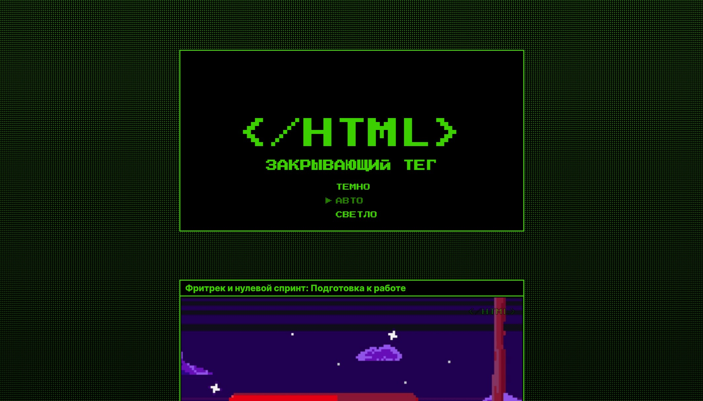

# Проект "Закрытый тег F"

[Демо-страница](https://sanyazola.github.io/zakrivayuschiy-teg-f/)

Проект демонстрирует работу изменения цветовой темы и интерактивной кнопкой **Like**.

## Описание

- Поддержка смены цветовой темы (светлая / тёмная / auto).
- Кнопка **Like**, которая реагирует на клики и меняет состояние.

## Установка
1. Клонирование репозитория
2. npm i

